# Can a diffusion model generate images that extend forever?

<table align="center">
  <tr>
    <td align="center">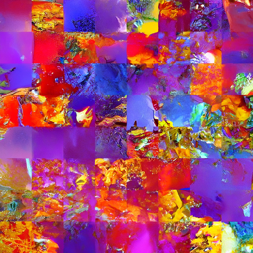</td>
    <td align="center">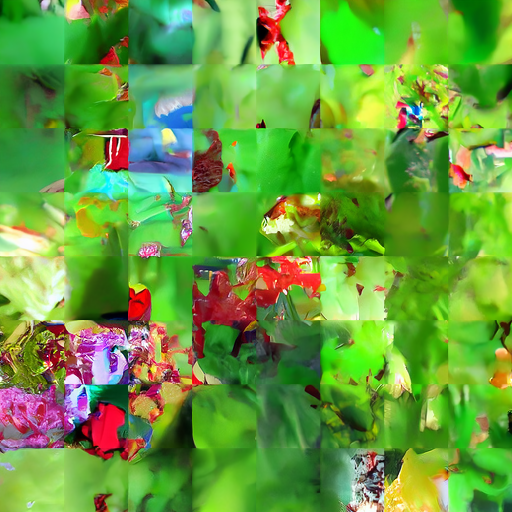</td>
  </tr>
  <tr>
    <td colspan="2" align="center"><em>Generated patch-by-patch from pure noise. No global planner, no fixed canvas. More in the <a href="#full-generation-gallery">full gallery</a>.</em></td>
  </tr>
</table>

**At a glance:**
- **Problem:** Standard diffusion models generate fixed-size images. Can we grow the canvas indefinitely, one patch at a time?
- **Approach:** Each patch is generated by a diffusion model conditioned on three spatial neighbors (L-shape) and a frozen vision backbone (CLIP or DINOv2). Fully autoregressive, no fixed canvas size.
- **What works:** Locally convincing patches, successful color/texture transfer from seed images, learned position-dependent statistics (sky at top).
- **What doesn't:** No coherent objects emerge across patches. Five backbone/position-encoding ablations all fail to produce cross-block structure.

Standard diffusion models generate fixed-size images. This project takes a different approach: generate images patch by patch, autoregressively, where each new patch is conditioned on three spatial neighbors in an L-shape: top-left, top-right, bottom-left. The L-shape is the key: it provides enough local context to generate coherently in any direction (right, down, or diagonally), so the canvas can grow without bound. Trained from scratch on 3,000&ndash;10,000 COCO images in pixel space. Builds on a [previous version](https://enazari.github.io/projects/trio-diffusion/) that had no global conditioning.

```
┌─────────────┬─────────────┐
│  TOP LEFT   │  TOP RIGHT  │  Context patches (known)
├─────────────┼─────────────┤
│ BOTTOM LEFT │    ????     │  Target patch (generated by diffusion)
└─────────────┴─────────────┘
```

<p align="center">
  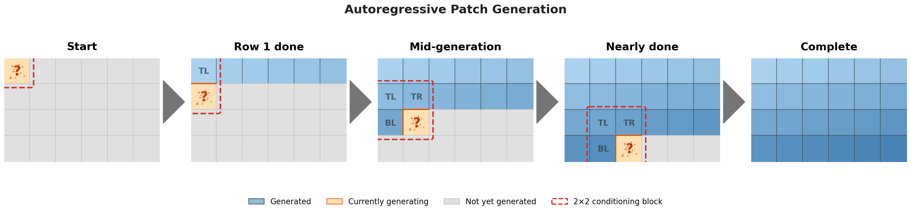
</p>

## Method

### Spatial inpainting

Each generation step is a 2&times;2 inpainting problem. The three context patches and the noisy target are tiled into a single spatial block `[B, 4, 2*bs, 2*bs]`: 3 RGB channels plus a binary mask indicating which quadrants are known. Because the patches sit at their true spatial positions, standard convolutions see across patch borders and learn seamless transitions. Unlike Patch Diffusion (Wang et al., NeurIPS 2023), which uses patches for training efficiency on fixed images, this is fully autoregressive over a potentially unbounded grid.

### RePaint conditioning

At every denoising step, the known regions (TL, TR, BL) are re-noised to their correct noise level and re-injected, providing persistent spatial context throughout the entire reverse process rather than injecting it once and hoping it survives 1,000 denoising steps. This is the key mechanism that keeps neighboring patches "visible" to the model at every step. From RePaint (Lugmayr et al., CVPR 2022). See [Design Decisions](#design-decisions) for the full formulation.

### Global context via vision backbones

A frozen vision backbone (CLIP or DINOv2) encodes a broader view of the scene and injects it into every UNet block via cross-attention. This tests whether off-the-shelf global features can act as a low-bandwidth planner for unbounded canvases. The backbone can be driven in two ways: (1) **autoregressive**: re-encode the partial canvas at each generation step, so the model "sees" its own output as the image grows and global context evolves with it. This is the intended mode for unbounded generation, though in practice CLIP and DINOv2 compress the growing canvas into a global embedding that loses the spatial information needed for local decisions; or (2) **seed image**: a fixed embedding from a reference image steers the entire generation. The cross-attention output is gated by a learned `tanh` scalar (initialized at 0.5, not zero; zero-init caused a starvation equilibrium, see [Design Decisions](#design-decisions)). Classifier-free guidance modulates backbone influence at inference.

### Training

The model is a UNet (177M parameters, base channels 96, self-attention at 16&times;16 and deeper) operating on 64&times;64 patches in pixel space; no VAE, no latent space. With a step size of 32 and overlapping extraction, even 3,000 COCO images yield a large number of training patches. 1,000 diffusion timesteps with a linear beta schedule. Multi-GPU training via `accelerate`. Experiments use frozen CLIP ViT-B/32 and frozen DINOv2 ViT-B/14 as the global context backbone.

## Results

### Patch completion

During validation, the model is tested on both training and unseen images. For each image, 4 random positions are picked. At each position, the model receives the three ground-truth context patches plus a CLIP embedding of the full image and generates the missing bottom-right patch. In each pair below, the left image is the original and the right has 4 patches replaced by model output. Can you spot them?

<table>
  <tr>
    <td align="center">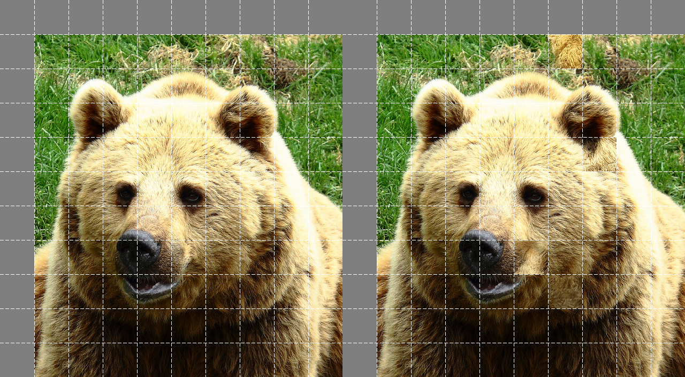<br><em>Training image (bear)</em></td>
    <td align="center">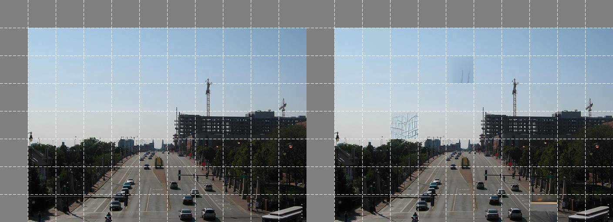<br><em>Unseen image (city road)</em></td>
  </tr>
</table>

Patches are locally convincing: edge continuity, texture, and color match their neighbors even on unseen images. The challenge is chaining them together; each patch is plausible in isolation, but global structure does not emerge.

### Unbounded generation

Full autoregressive raster-scan: every patch is generated sequentially, each conditioned on previously generated neighbors. Vibrant textures emerge, but no recognizable objects spanning multiple patches. More examples in the [full gallery](#full-generation-gallery).

<table>
  <tr>
    <td align="center">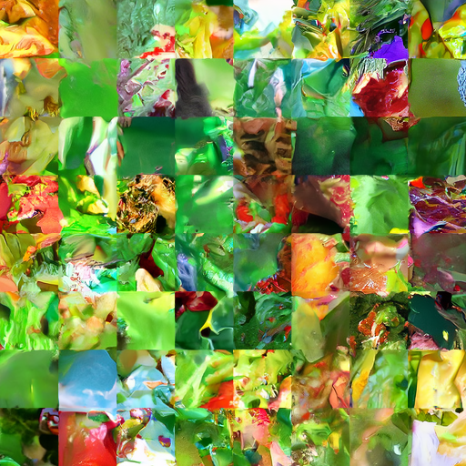<br><em>CLIP (10K), seed 1</em></td>
    <td align="center">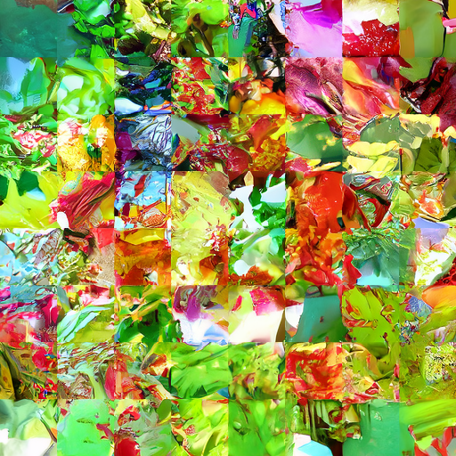<br><em>CLIP (10K), seed 2</em></td>
    <td align="center">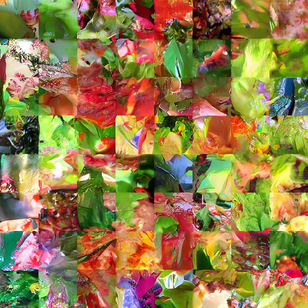<br><em>CLIP (10K), seed 3</em></td>
    <td align="center"><br><em>CLIP (10K), seed 4</em></td>
  </tr>
</table>

### What the model learned

#### Color and texture transfer

When conditioned on a seed image, the backbone successfully transfers color palette and texture to the generated output. The dark greens of the leaf and the rainy speckle of the blurred image both carry through clearly.

<table>
  <tr>
    <td align="center"><br><em>📷 Real photo (leaf)</em></td>
    <td align="center">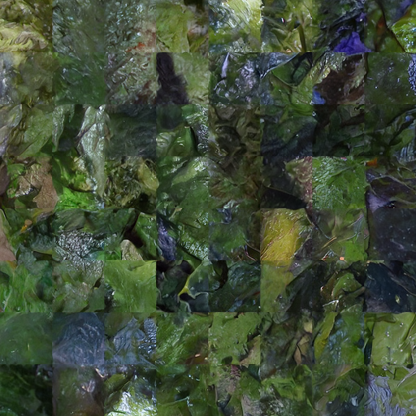<br><em> Generated, DINOv2 (3K)</em></td>
    <td align="center">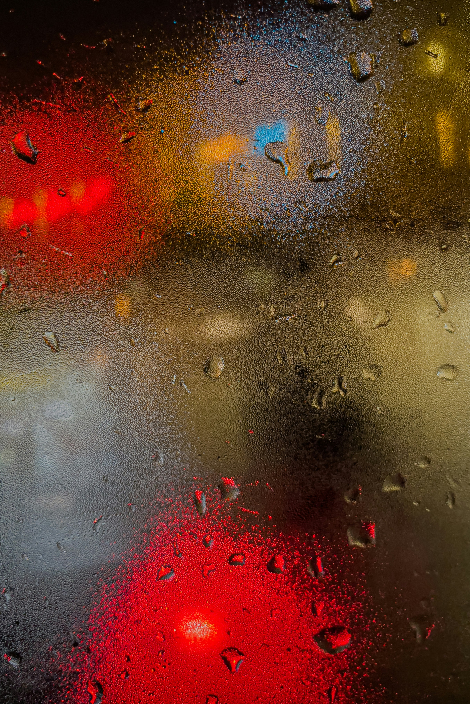<br><em>📷 Real photo (blurred)</em></td>
    <td align="center">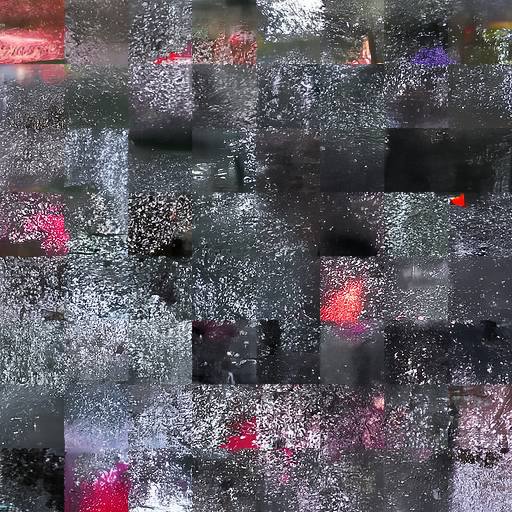<br><em> Generated, DINOv2 (10K)</em></td>
  </tr>
</table>

#### Position-dependent statistics

An interesting observation with the DINOv2 backbone: in the umbrella-seeded generations, sky-blue tones consistently appear near the top of the image across different random seeds, matching the spatial layout of the original photograph where the sky occupies the upper portion. This pattern holds across both the 3K and 10K dataset variants:

<table>
  <tr>
    <td align="center"><br><em>📷 Real photo</em></td>
    <td align="center">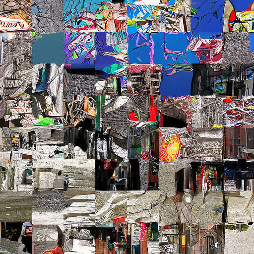<br><em> DINOv2 (3K), seed 1</em></td>
    <td align="center">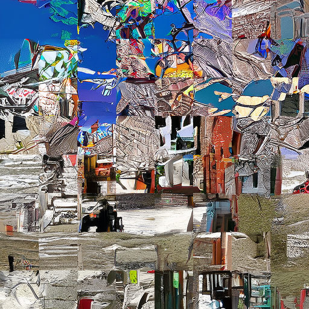<br><em> DINOv2 (3K), seed 2</em></td>
    <td align="center"><br><em> DINOv2 (10K), seed 1</em></td>
  </tr>
</table>

This suggests the model has learned position-dependent statistics through the combination of positional encoding and backbone conditioning; it knows that sky belongs at the top. The global coherence problem is not about whether the model can use positional or semantic information at all, but about whether it can coordinate *structure* across patches.

Seed images by [@itsomidarmin](https://unsplash.com/@itsomidarmin).

### Ablation: no backbone, no position encoding

Without any global conditioning or positional signal (`no_backbone_no_position_encoding_3k` config), the model generates each patch in isolation. The result is incoherent texture soup; each patch is plausible on its own, but adjacent patches jump between unrelated textures with no locality or cohesion:

<table>
  <tr>
    <td align="center">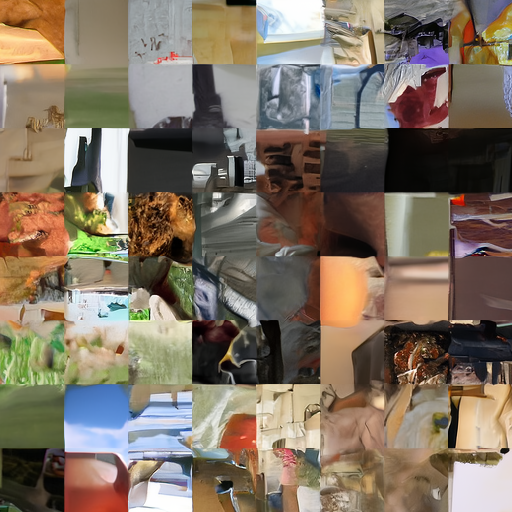<br><em>No backbone, no pos. enc., seed 1</em></td>
    <td align="center">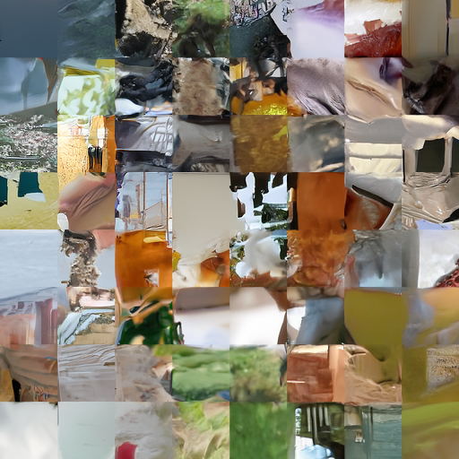<br><em>No backbone, no pos. enc., seed 2</em></td>
  </tr>
</table>

### What didn't work

#### CLIP text conditioning

CLIP's text encoder can drive the cross-attention pathway instead of an image encoder. In theory, a text prompt like "blue" or "red" should steer the output. In practice, the model ignores text embeddings entirely; "blue", "red", and "cat" produce nearly identical outputs:

<table>
  <tr>
    <td align="center">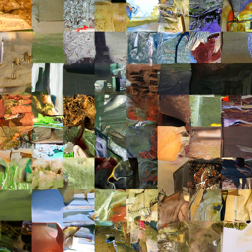<br><em>Text: &ldquo;blue&rdquo;</em></td>
    <td align="center">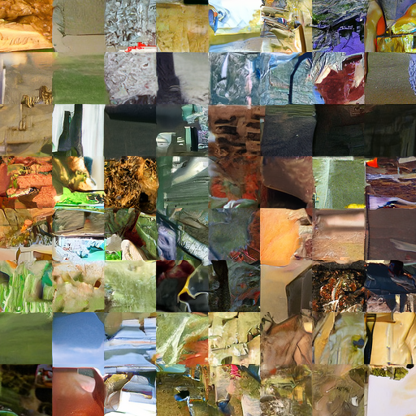<br><em>Text: &ldquo;red&rdquo;</em></td>
    <td align="center"><br><em>Text: &ldquo;cat&rdquo;</em></td>
  </tr>
</table>

The cross-attention pathway learns from image embeddings during training. CLIP text embeddings occupy a different region of the shared embedding space; close enough in CLIP's contrastive sense, but too far out-of-distribution for the learned cross-attention gates to act on.

#### Systematic experiment summary

The [previous version](https://enazari.github.io/projects/trio-diffusion/) had no global conditioning at all. In this version, I systematically tested whether vision backbones and positional encoding could give the model a sense of broader scene structure. Five configurations, all trained for 475+ epochs on the same data:

| Config | Backbone | Data | Pos. Enc. |
|--------|----------|------|-----------|
| `clip_10k` | CLIP ViT-B/32 (frozen) | 10K | Yes |
| `dino_3k` | DINOv2 ViT-B/14 (frozen) | 3K | Yes |
| `dino_10k` | DINOv2 ViT-B/14 (frozen) | 10K | Yes |
| `no_backbone_3k` | None | 3K | Yes |
| `no_backbone_no_position_encoding_3k` | None | 3K | No |

**Position encoding alone does nothing.** `no_backbone_3k` and `no_backbone_no_position_encoding_3k` produce identical results; without a global signal, positional encoding has no effect.

**Backbone injection provides context but not structure.** CLIP and DINOv2 successfully transfer color palette, texture, and position-dependent statistics (sky at top), but coherent objects never emerge across patch boundaries.

**More data doesn't help.** `dino_3k` and `dino_10k` show no difference, suggesting the bottleneck is architectural, not data-limited.

I surmise the bottleneck is architectural. During autoregressive generation, each patch only ever sees three real neighbors in a 2&times;2 window. Any global signal from CLIP or DINOv2 must survive through a chain of locally generated patches, and it does not. The backbone embeddings encode high-level semantics (scene type, dominant color) but not the spatial layout information needed to coordinate structure across patch boundaries. The cross-attention gates learn to use backbone features (gate values settle around 0.3&ndash;0.5), but the features themselves lack the spatial resolution to guide local patch decisions.

## Open questions

Two distinct problems remain unsolved:

### 1. Why are patch boundaries still visible?

The trio context gives each patch three immediate neighbors, and RePaint conditioning re-injects them at every denoising step. Yet seam artifacts persist. The model learns to match texture and color across borders, but fine-grained continuity (edges, gradients, high-frequency detail) breaks at patch boundaries. Possible directions:

- **Overlapping patches with blending.** Generate patches with overlap and blend the overlapping regions, so each patch has direct pixel-level continuity with more than three neighbors.
- **Boundary continuity loss.** An explicit loss on patch edges, as attempted in the [previous version](https://enazari.github.io/projects/trio-diffusion/), which used pixel-level MSE and gradient-based MSE (Sobel filters) at boundaries. That version reduced seams but did not eliminate them; revisiting with stronger formulations (adversarial boundary discriminator, perceptual loss at edges) may help.

### 2. Why don't coherent objects emerge across multiple trio blocks?

The model generates plausible textures and learns position-dependent color statistics, but never forms recognizable structures: no trees, no buildings, no objects that span more than one patch. Each patch is generated in a 2&times;2 window with at most three neighbors; any structural plan must survive a chain of locally generated patches, and it does not. Possible directions:

- **Hierarchical latent planning.** Generate a coarse low-resolution layout of the full image first, then condition each patch on its corresponding region. This gives each patch access to global structure without expanding the 2&times;2 window.
- **Multi-scale context windows.** Instead of (or alongside) CLIP/DINOv2, feed the model a downsampled view of the full canvas generated so far, in addition to the three high-resolution neighbor patches.

I invite you to pick up where it leaves off. If you have ideas or want to build on this, please reach out.

---

<details>
<summary><strong><a id="full-generation-gallery"></a>Full generation gallery</strong></summary>

### Progressive generation (no seed image)

The model generates from pure noise, re-encoding the partial canvas with the backbone at each step.

#### CLIP ViT-B/32 (10K)

<table>
  <tr>
    <td align="center"></td>
    <td align="center"></td>
    <td align="center"></td>
    <td align="center"></td>
  </tr>
  <tr>
    <td align="center"><em>seed 1</em></td>
    <td align="center"><em>seed 2</em></td>
    <td align="center"><em>seed 3</em></td>
    <td align="center"><em>seed 4</em></td>
  </tr>
</table>

#### DINOv2 ViT-B/14 (10K)

<table>
  <tr>
    <td align="center">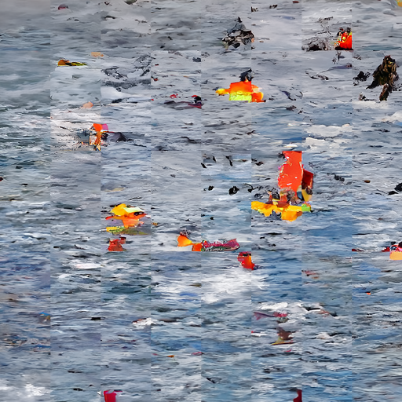</td>
    <td align="center">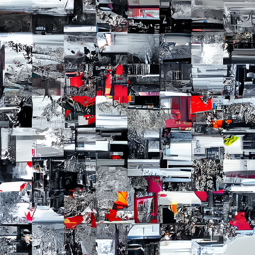</td>
    <td align="center">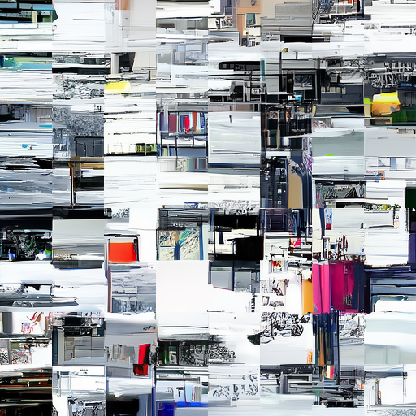</td>
    <td align="center">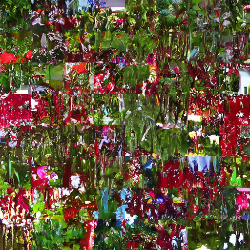</td>
    <td align="center">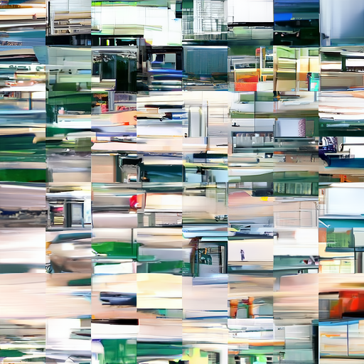</td>
  </tr>
  <tr>
    <td align="center"><em>seed 2</em></td>
    <td align="center"><em>seed 3</em></td>
    <td align="center"><em>seed 6</em></td>
    <td align="center"><em>seed 7</em></td>
    <td align="center"><em>seed 8</em></td>
  </tr>
  <tr>
    <td align="center">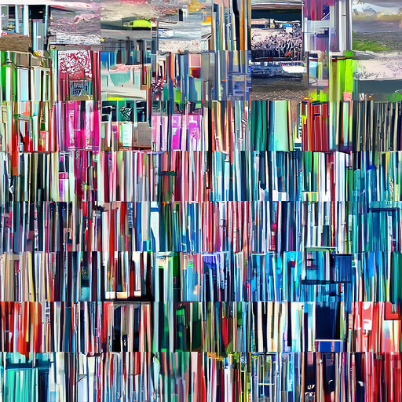</td>
    <td align="center">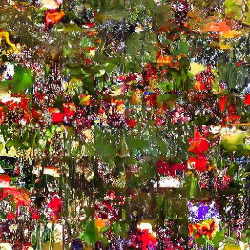</td>
    <td align="center">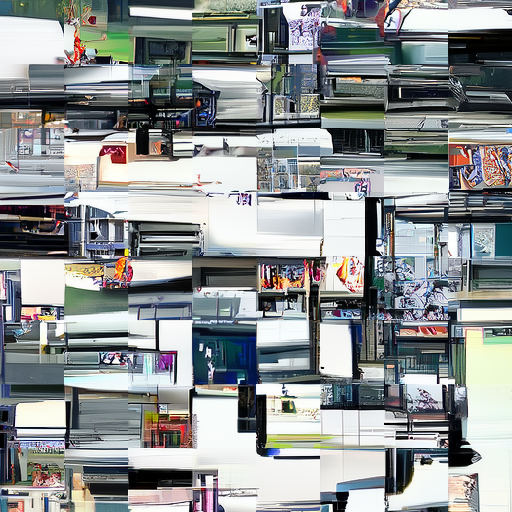</td>
  </tr>
  <tr>
    <td align="center"><em>seed 9</em></td>
    <td align="center"><em>seed 10</em></td>
    <td align="center"><em>seed 11</em></td>
  </tr>
</table>

### Seed-conditioned generation

Each row: seed image &rarr; CLIP (10K) output &rarr; DINOv2 (10K) output.

<table>
  <tr>
    <th>📷 Seed (real photo)</th>
    <th> CLIP (10K)</th>
    <th> DINOv2 (10K)</th>
  </tr>
  <tr>
    <td align="center"><br><em>Umbrella</em></td>
    <td align="center">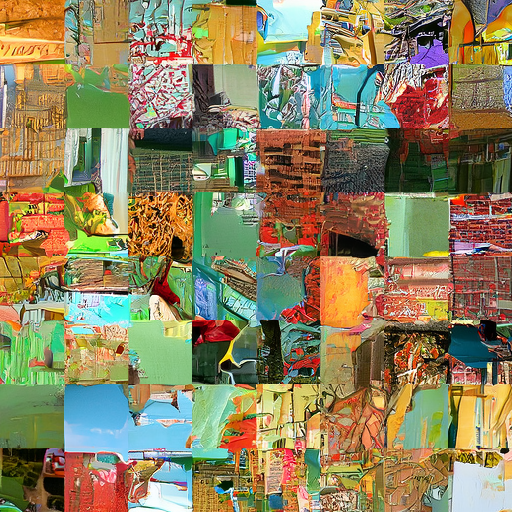</td>
    <td align="center">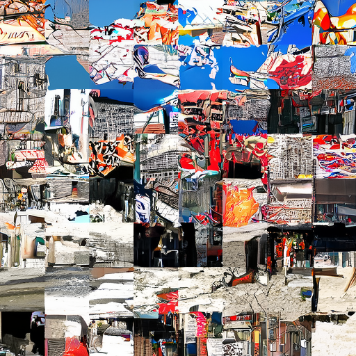</td>
  </tr>
  <tr>
    <td align="center"><br><em>Tulip</em></td>
    <td align="center">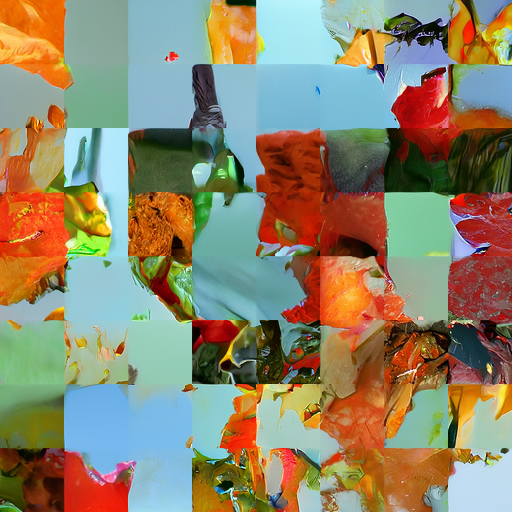</td>
    <td align="center">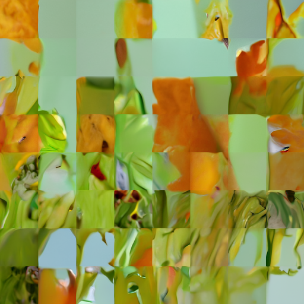</td>
  </tr>
  <tr>
    <td align="center">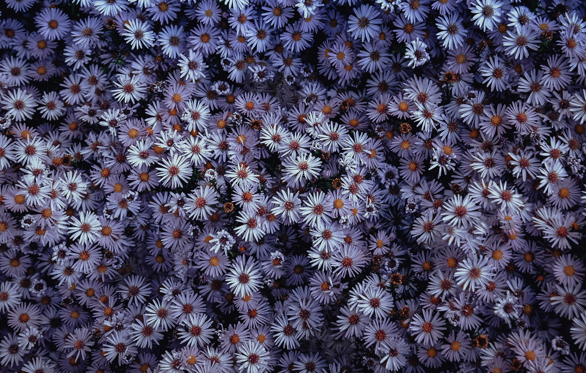<br><em>Flower</em></td>
    <td align="center">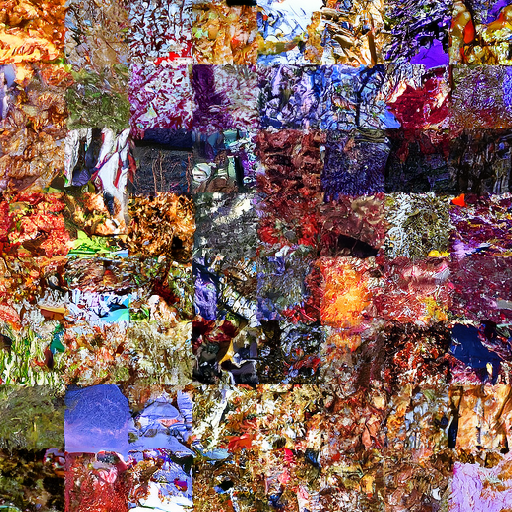</td>
    <td align="center">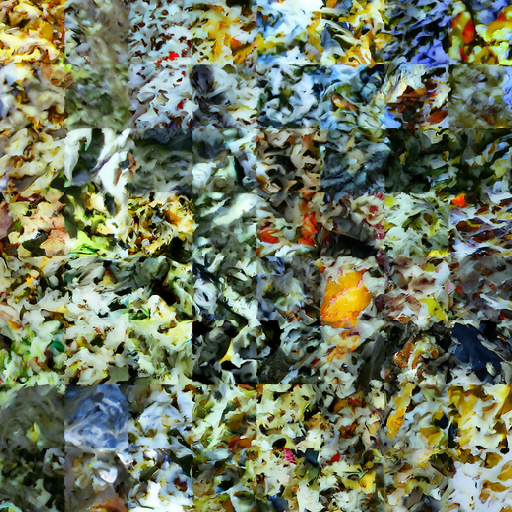</td>
  </tr>
  <tr>
    <td align="center"><br><em>Leaf</em></td>
    <td align="center">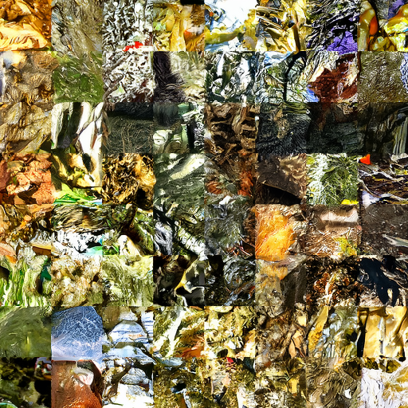</td>
    <td align="center"></td>
  </tr>
  <tr>
    <td align="center"><br><em>Cat</em></td>
    <td align="center">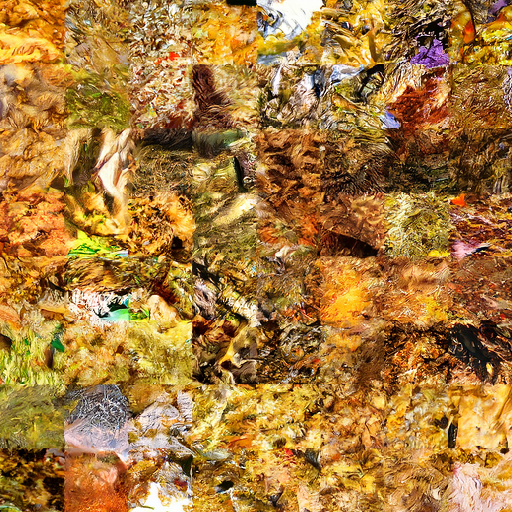</td>
    <td align="center"></td>
  </tr>
  <tr>
    <td align="center">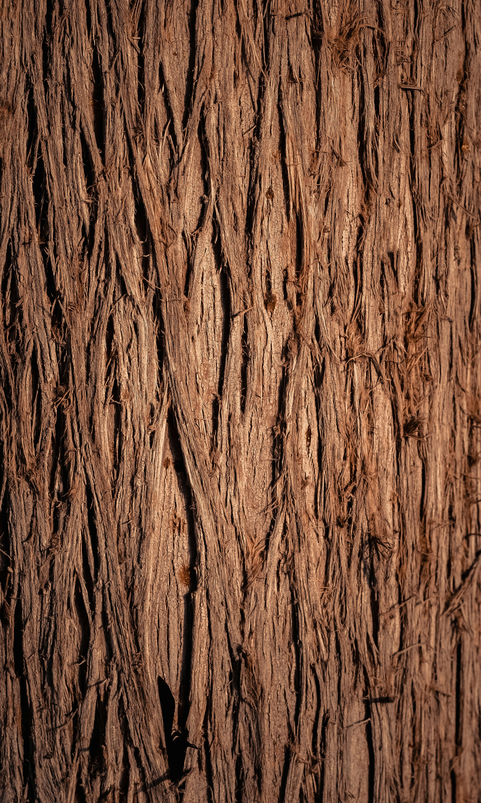<br><em>Trunk</em></td>
    <td align="center">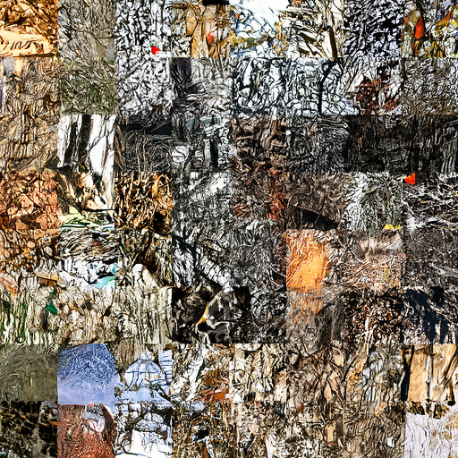</td>
    <td align="center">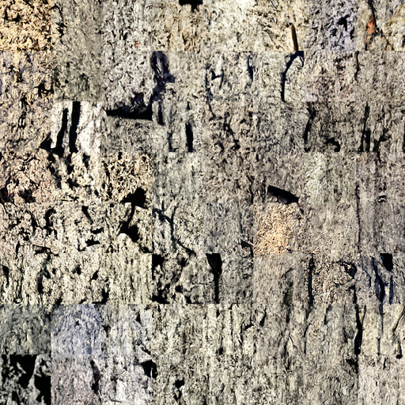</td>
  </tr>
  <tr>
    <td align="center"><br><em>Purple</em></td>
    <td align="center">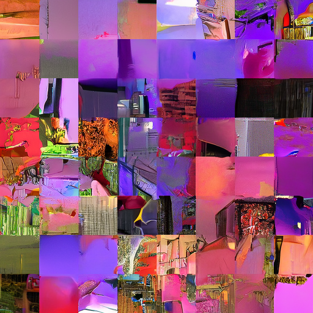</td>
    <td align="center">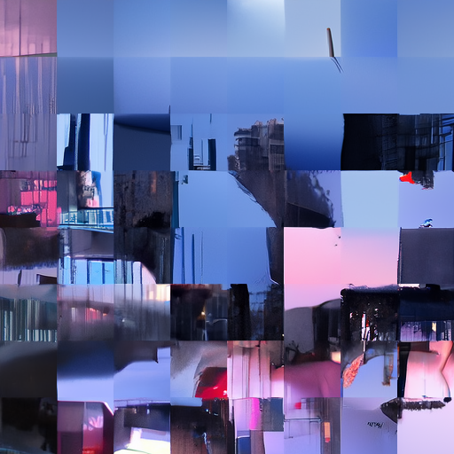</td>
  </tr>
  <tr>
    <td align="center"><br><em>Blurred</em></td>
    <td align="center">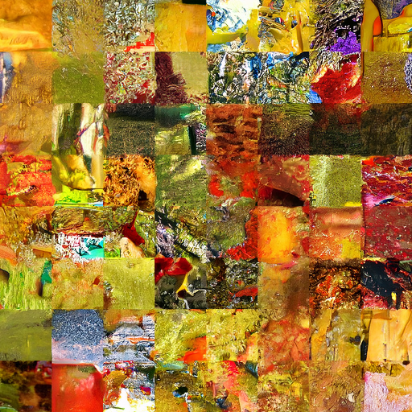</td>
    <td align="center"></td>
  </tr>
</table>

Seed images by [@itsomidarmin](https://unsplash.com/@itsomidarmin).

</details>

<details>
<summary><strong><a id="design-decisions"></a>Design Decisions (15 documented choices with rationale)</strong></summary>

### Spatial inpainting format

The model input is `[B, 4, 2*bs, 2*bs]`: a 2&times;2 spatial block (3 RGB channels) with a binary mask (1 channel). The three known context patches sit at their true spatial positions (TL, TR, BL) and the bottom-right quadrant is the noisy target. This replaces an earlier design that channel-concatenated all four patches into `[B, 12, bs, bs]`, which destroyed spatial adjacency; a 3&times;3 conv kernel couldn't see across patch borders, causing visible seams. With spatial layout, standard convolutions naturally learn seamless transitions at boundaries. This is the same format used by Stable Diffusion Inpainting and LDM Inpainting.

### RePaint conditioning

At every denoising step, the known regions (TL, TR, BL) are replaced with their correctly-noised clean values: `sqrt(alpha_t) * x_known + sqrt(1 - alpha_t) * noise`. This provides persistent context throughout the reverse process, rather than injecting it once at the input and hoping it survives. Without this, context information degraded through the denoising steps and the model had to simultaneously denoise and remember context. From RePaint (Lugmayr et al., CVPR 2022).

### Tanh-gated cross-attention

Cross-attention output is scaled by `tanh(gate)` where `gate` is a learnable scalar. Initially tried `gate_init=0.0` (zero-init, as in ControlNet); the idea was to let the model learn spatial texture first, then gradually incorporate CLIP. This failed: combined with CFG dropout, zero-init created a starvation equilibrium where CLIP never received gradients and gates stayed at zero for 500 epochs. The fix was `gate_init=0.5` (so `tanh(0.5) ≈ 0.46`), giving CLIP meaningful influence from epoch 1 while still allowing gates to close if unhelpful.

### Decoupled CFG dropout

CFG dropout only swaps the backbone embedding for a learned unconditional embedding; spatial context is always preserved. An earlier version zeroed both spatial context and backbone simultaneously during dropout, which coupled two independent signals. The CFG guidance direction now purely measures "what the backbone adds on top of spatial context."

### Learned unconditional embedding

The unconditional embedding for classifier-free guidance is a learnable `nn.Parameter` on the model, not a precomputed encoding. An earlier version passed a grey image through CLIP, but uniform grey is out-of-distribution for CLIP; it produced degenerate tokens. The learned embedding lets the model discover what "no backbone conditioning" means in embedding space.

### Context noise augmentation

During training, Gaussian noise is added to context patches with probability `context_noise_prob=0.3` and scale up to `context_noise_scale=0.2`. This simulates the imperfect context encountered during autoregressive generation, where context patches are model-generated rather than ground truth. Without this, errors compound across patches; the model was never trained on imperfect context, so each generation step amplifies drift.

### Context patch dropout

For 1/3 of training samples, 1, 2, or all 3 context patches are zeroed out (chosen uniformly). This teaches the model to generate from partial or no local context, matching edge and corner conditions during autoregressive generation; the very first patch has no neighbors, edge patches have only 1&ndash;2.

### Grey border padding

A grey ribbon is added to the top and left of each training image. During autoregressive generation, the first row and first column of patches have no top or left neighbors; those positions are filled with zeros (grey in normalized space). Without exposing the model to grey-filled context during training, it would never learn how to start generation from an empty canvas. The padding ensures that grey-bordered patches appear naturally in the training distribution.

### Per-pixel coordinate channels

Two normalized coordinate maps (Y, X) are concatenated to the model input, changing shape from `[B, 4, H, W]` to `[B, 6, H, W]`. Each pixel knows its absolute position in the image grid. This complements the coarser per-patch position encoding and follows Patch Diffusion (Wang et al., NeurIPS 2023).

### Position encoding via time embedding

Each patch's normalized grid position `(row/grid_h, col/grid_w)` is encoded with sinusoidal embeddings, processed through an MLP, and added to the time embedding. This piggybacks on the existing AdaGN pathway that already injects timestep into every ResidualBlock; zero architectural changes needed. Without position encoding, the model had no idea where in the image it was generating, producing locally plausible but globally incoherent images.

### Dilated depthwise convolutions at 32x32

Self-attention only operates at 16&times;16 and deeper. Skip connections from 32&times;32 carry features with ~9px effective receptive field, too small to cross the quadrant boundary at position 16. Full self-attention at 32&times;32 caused OOM. Dilated depthwise convolutions (dilation 4 and 8) expand the receptive field to 16+ pixels with negligible memory cost (~7K params), giving the decoder cross-quadrant awareness via skip connections.

### Multi-pass refinement

After the initial raster-scan pass, refinement passes re-generate every patch using full-canvas context. Early patches in the first pass have minimal context (mostly padding); refinement gives them the complete scene. Each pass re-encodes the canvas with CLIP for updated global context.

### Teacher forcing schedule

Training uses teacher forcing: context patches are always ground truth. Context noise augmentation (see above) partially bridges the train/test gap, but a curriculum that gradually replaces ground truth context with model-generated context during training could further reduce exposure bias.

### Classifier-free guidance scale

CFG scale is set to 2.0 at inference. Higher values (5.0+) oversaturate colors and amplify artifacts. Lower values (1.0) produce muted, less coherent results. The sweet spot was found empirically.

### Training on 3,000&ndash;10,000 COCO images

Deliberately small datasets to test whether the architecture can learn patch-level generation without massive data. The model memorizes training images at the patch level but generalizes texture and color statistics to unseen images. Scaling to larger datasets is straightforward: just point `DATASET_PATH` to a larger folder.

</details>

<details>
<summary><strong>Setup & Usage</strong></summary>

### Setup

```bash
conda env create -f environment.yaml
conda activate trio
cp .env.example .env   # edit with your dataset path
```

The dataset is any folder of images (`.jpg`, `.png`, `.bmp`, `.tiff`, `.webp`). No labels required; just point `DATASET_PATH` in `.env` to the folder. Images must be at least 256&times;256.

### Training

```bash
# Single GPU
python train.py --config clip_10k

# Multi-GPU
accelerate launch train.py --config clip_10k
```

Training creates a session folder under `sessions/` with checkpoints, evaluations, and loss history.

### Generation

```bash
python scripts/generate.py sessions/<session_dir>/
```

See `generation/generate.sh` for batch generation across all modes (progressive, seed-conditioned, text-conditioned).

### SLURM cluster

```bash
cd hpc && bash _download_models.sh && cd ..   # pre-download weights (login node)
bash hpc/clip.sh                               # reads .env, self-submits via sbatch
```

</details>
